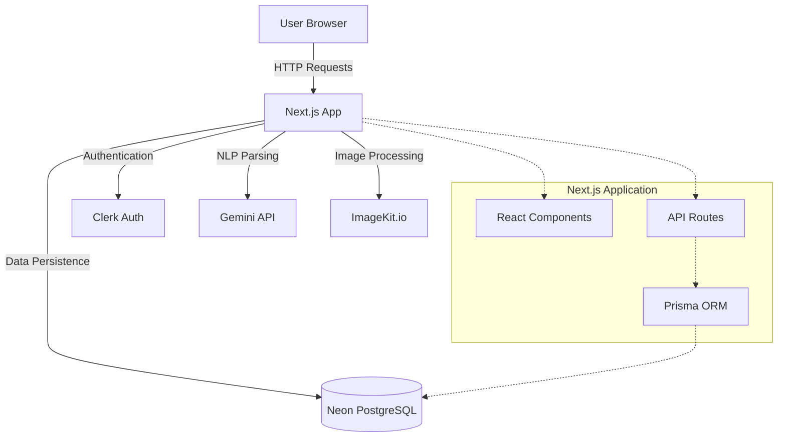

# Design Document

## Overview

The NLP Image Processor is a full-stack Next.js application that translates natural language image processing requests into structured JSON specifications. The system leverages Gemini LLM for natural language understanding, Clerk for authentication, Prisma with Neon PostgreSQL for data persistence, and ImageKit.io for actual image transformations.

The application follows a modern serverless architecture with API routes handling business logic, React Server Components for the UI, and external service integrations for specialized functionality.

## Architecture

### High-Level Architecture



### Technology Stack

- **Frontend**: Next.js 14+ (App Router), React, TypeScript, Tailwind CSS
- **Authentication**: Clerk
- **Database**: Neon PostgreSQL with Prisma ORM
- **NLP**: Google Gemini API
- **Image Processing**: ImageKit.io SDK
- **Deployment**: Vercel (recommended) or similar Next.js-compatible platform

### Request Flow

1. User submits natural language query through UI
2. Next.js API route receives request and validates authentication via Clerk
3. Query is sent to Gemini API with structured prompt
4. Gemini returns JSON specification
5. System validates and stores the query/response in database
6. If image is uploaded, specifications are sent to ImageKit.io
7. Processed image URL is returned to user
8. UI displays results

## Components and Interfaces

### 1. Frontend Components

#### QueryInput Component
```typescript
interface QueryInputProps {
  onSubmit: (query: string) => Promise<void>;
  isLoading: boolean;
}
```
- Text input for natural language queries
- Submit button with loading state
- Example queries for user guidance

#### ImageUpload Component
```typescript
interface ImageUploadProps {
  onUpload: (file: File) => Promise<void>;
  acceptedFormats: string[];
  maxSizeMB: number;
}
```
- Drag-and-drop file upload
- File validation (type, size)
- Preview of uploaded image

#### ResultDisplay Component
```typescript
interface ResultDisplayProps {
  jsonOutput: ImageProcessingSpec;
  processedImageUrl?: string;
  originalQuery: string;
}
```
- Formatted JSON display
- Processed image preview
- Download options

#### HistoryList Component
```typescript
interface HistoryListProps {
  userId: string;
  onSelectQuery: (query: ProcessingRequest) => void;
}
```
- List of previous queries
- Pagination support
- Filter and search capabilities

### 2. API Routes

#### POST /api/parse-query
```typescript
interface ParseQueryRequest {
  query: string;
  userId: string;
}

interface ParseQueryResponse {
  success: boolean;
  data?: ImageProcessingSpec;
  error?: string;
}
```
- Accepts natural language query
- Calls Gemini API for parsing
- Returns structured JSON

#### POST /api/process-image
```typescript
interface ProcessImageRequest {
  imageFile: File;
  specifications: ImageProcessingSpec;
  userId: string;
}

interface ProcessImageResponse {
  success: boolean;
  imageUrl?: string;
  error?: string;
}
```
- Accepts image and specifications
- Uploads to ImageKit.io
- Applies transformations
- Returns processed image URL

#### GET /api/history
```typescript
interface HistoryRequest {
  userId: string;
  page?: number;
  limit?: number;
}

interface HistoryResponse {
  success: boolean;
  data?: ProcessingRequest[];
  total?: number;
  error?: string;
}
```
- Retrieves user's processing history
- Supports pagination
- Returns list of previous requests

### 3. Service Layer

#### GeminiService
```typescript
class GeminiService {
  async parseQuery(query: string): Promise<ImageProcessingSpec>;
  private buildPrompt(query: string): string;
  private validateResponse(response: any): ImageProcessingSpec;
}
```
- Handles Gemini API communication
- Constructs prompts with parsing rules
- Validates and sanitizes responses

#### ImageKitService
```typescript
class ImageKitService {
  async uploadImage(file: Buffer, fileName: string): Promise<string>;
  async transformImage(
    imageUrl: string, 
    specs: ImageProcessingSpec
  ): Promise<string>;
  private buildTransformations(specs: ImageProcessingSpec): TransformationParams;
}
```
- Manages ImageKit.io SDK
- Converts JSON specs to ImageKit transformations
- Handles upload and transformation operations

#### DatabaseService
```typescript
class DatabaseService {
  async saveRequest(
    userId: string, 
    query: string, 
    jsonOutput: ImageProcessingSpec
  ): Promise<ProcessingRequest>;
  
  async getUserHistory(
    userId: string, 
    page: number, 
    limit: number
  ): Promise<ProcessingRequest[]>;
  
  async getRequestById(id: string): Promise<ProcessingRequest | null>;
}
```
- Abstracts Prisma operations
- Handles database queries
- Manages error handling

## Data Models

### Prisma Schema

```prisma
model User {
  id        String   @id @default(cuid())
  clerkId   String   @unique
  email     String   @unique
  createdAt DateTime @default(now())
  updatedAt DateTime @updatedAt
  requests  ProcessingRequest[]
}

model ProcessingRequest {
  id              String   @id @default(cuid())
  userId          String
  user            User     @relation(fields: [userId], references: [id])
  query           String
  jsonOutput      Json
  processedImageUrl String?
  createdAt       DateTime @default(now())
  
  @@index([userId, createdAt])
}
```

### TypeScript Interfaces

```typescript
interface ImageProcessingSpec {
  task_type: TaskType;
  dimensions: Dimensions;
  dpi: number | null;
  background: Background | null;
  face_requirements: FaceRequirements | null;
  max_file_size_mb: number | null;
  format: ImageFormat | null;
  additional_notes: string | null;
}

type TaskType = 
  | "passport_photo" 
  | "resize" 
  | "compress" 
  | "background_change" 
  | "enhance" 
  | "format_change" 
  | "custom";

interface Dimensions {
  width_mm: number | null;
  height_mm: number | null;
  width_px: number | null;
  height_px: number | null;
}

type Background = "white" | "blue" | "transparent" | "original";

interface FaceRequirements {
  shoulders_visible: boolean | null;
  ears_visible: boolean | null;
  centered_face: boolean | null;
  no_tilt: boolean | null;
}

type ImageFormat = "jpg" | "jpeg" | "png" | "webp";

interface ProcessingRequest {
  id: string;
  userId: string;
  query: string;
  jsonOutput: ImageProcessingSpec;
  processedImageUrl?: string;
  createdAt: Date;
}
```


## Correctness Properties

*A property is a characteristic or behavior that should hold true across all valid executions of a system—essentially, a formal statement about what the system should do. Properties serve as the bridge between human-readable specifications and machine-verifiable correctness guarantees.*

### Property 1: Query acceptance
*For any* non-empty text string, the system should accept it as input and return a valid ImageProcessingSpec without throwing errors.
**Validates: Requirements 1.1**

### Property 2: Ambiguous query handling
*For any* query that lacks clear specifications, the system should set task_type to "custom" and only populate fields that can be confidently determined from the input.
**Validates: Requirements 1.3**

### Property 3: Multi-unit dimension support
*For any* query containing dimensions in pixels, millimeters, or inches, the system should correctly parse and populate the appropriate dimension fields.
**Validates: Requirements 1.5**

### Property 4: Standard passport defaults
*For any* query containing the keywords "passport", "passport-size", or "passport photo", the system should set width_mm=35, height_mm=45, dpi=300, background="white", format="jpg", and all face_requirements to true.
**Validates: Requirements 2.1, 2.3**

### Property 5: US passport defaults
*For any* query containing "US passport" or "2x2 inch", the system should set width_mm=51, height_mm=51, dpi=300, background="white", format="jpg", and all face_requirements to true.
**Validates: Requirements 2.2, 2.3**

### Property 6: Custom parameter override
*For any* query with passport keywords and explicit custom parameters, the system should apply passport defaults first, then override with user-specified values.
**Validates: Requirements 2.4**

### Property 7: Pixel dimension parsing
*For any* query with pixel dimensions in format "WxH" or "W x H pixels", the system should correctly populate width_px and height_px fields with the specified values.
**Validates: Requirements 3.1**

### Property 8: Millimeter dimension parsing
*For any* query with millimeter dimensions, the system should correctly populate width_mm and height_mm fields.
**Validates: Requirements 3.2**

### Property 9: Inch to millimeter conversion
*For any* query with inch dimensions, the system should convert to millimeters (1 inch = 25.4mm) and populate width_mm and height_mm fields.
**Validates: Requirements 3.3**

### Property 10: DPI extraction
*For any* query mentioning "PPI" or "DPI" followed by a numeric value, the system should extract and set the dpi field to that number.
**Validates: Requirements 4.1**

### Property 11: File size constraint parsing
*For any* query with file size constraints (e.g., "under XMB", "compress to XKB"), the system should parse and set max_file_size_mb to the appropriate value in megabytes.
**Validates: Requirements 4.2**

### Property 12: Compression default
*For any* query containing compression keywords without specific size, the system should set max_file_size_mb to 1.
**Validates: Requirements 4.3**

### Property 13: Multiple constraints coexistence
*For any* query specifying both DPI and file size, the system should populate both dpi and max_file_size_mb fields in the output.
**Validates: Requirements 4.4**

### Property 14: Background color mapping
*For any* query requesting "white background", "blue background", "remove background", or "transparent background", the system should set the background field to "white", "blue", "transparent", or "transparent" respectively.
**Validates: Requirements 5.1, 5.2, 5.3**

### Property 15: Background removal task type
*For any* query requesting background removal, the system should set task_type to "background_change".
**Validates: Requirements 5.5**

### Property 16: Format extraction
*For any* query specifying image format conversion (JPG, JPEG, PNG, WebP), the system should set the format field to the corresponding value.
**Validates: Requirements 6.1, 6.2, 6.3**

### Property 17: Format normalization
*For any* query using "jpeg" or "jpg", the system should normalize both to "jpg" in the format field.
**Validates: Requirements 6.5**

### Property 18: Valid JSON output
*For any* query, the system should return output that is valid JSON parseable by standard JSON parsers without errors.
**Validates: Requirements 7.1**

### Property 19: Complete schema
*For any* generated output, all required fields (task_type, dimensions, dpi, background, face_requirements, max_file_size_mb, format, additional_notes) should be present.
**Validates: Requirements 7.2**

### Property 20: Null for undetermined fields
*For any* query where specific fields cannot be determined, those fields should be set to null rather than omitted or given arbitrary values.
**Validates: Requirements 7.3**

### Property 21: Pure JSON response
*For any* system output, there should be no text, explanations, or markdown formatting before or after the JSON object.
**Validates: Requirements 7.5**

### Property 22: Database persistence
*For any* submitted query, after processing, the query text and generated JSON should exist in the database associated with the user's ID.
**Validates: Requirements 9.1, 9.2**

### Property 23: Chronological history ordering
*For any* user with multiple requests, retrieving their history should return requests ordered by creation time (newest first or oldest first consistently).
**Validates: Requirements 9.3**

### Property 24: File validation
*For any* uploaded file, the system should validate type and size, rejecting files that don't match supported formats (JPEG, PNG, WebP) or exceed size limits.
**Validates: Requirements 10.1, 10.5**

### Property 25: Gemini response parsing
*For any* valid JSON response from Gemini API, the system should successfully parse it into an ImageProcessingSpec structure.
**Validates: Requirements 11.2**

### Property 26: Query caching
*For any* identical query submitted multiple times, the system should return the same cached result without re-processing.
**Validates: Requirements 12.4**

### Property 27: Error message presence
*For any* invalid input or processing failure, the system should return an error response containing a descriptive message.
**Validates: Requirements 13.1**

### Property 28: Validation error details
*For any* validation failure, the error message should specify which fields or constraints were violated.
**Validates: Requirements 13.3**

## Error Handling

### Error Categories

1. **Input Validation Errors**
   - Empty queries
   - Invalid file types
   - File size exceeded
   - Malformed requests

2. **External Service Errors**
   - Gemini API failures (timeout, rate limit, invalid response)
   - ImageKit.io failures (upload failed, transformation failed)
   - Clerk authentication failures
   - Database connection errors

3. **Processing Errors**
   - JSON parsing failures
   - Invalid specifications
   - Unsupported operations

### Error Response Format

```typescript
interface ErrorResponse {
  success: false;
  error: {
    code: string;
    message: string;
    details?: Record<string, any>;
  };
}
```

### Error Handling Strategy

- **Validation errors**: Return 400 Bad Request with specific field errors
- **Authentication errors**: Return 401 Unauthorized and redirect to login
- **External service errors**: Return 503 Service Unavailable with retry guidance
- **Server errors**: Return 500 Internal Server Error with generic message, log details
- **Rate limiting**: Return 429 Too Many Requests with retry-after header

### Retry Logic

- Gemini API calls: 3 retries with exponential backoff
- ImageKit.io operations: 2 retries with linear backoff
- Database operations: 2 retries for transient errors

### Fallback Mechanisms

- If Gemini API fails after retries, return error to user (no local fallback parser)
- If ImageKit.io fails, store specifications for later retry
- If database write fails, log error but still return parsed JSON to user

## Testing Strategy

### Unit Testing

The application will use **Vitest** as the testing framework for unit tests. Unit tests will cover:

- **Utility functions**: Dimension conversion, unit parsing, format normalization
- **Validation logic**: Input validation, schema validation, file type checking
- **Service layer methods**: Individual methods in GeminiService, ImageKitService, DatabaseService
- **API route handlers**: Request/response handling, error cases
- **Component rendering**: React component output with React Testing Library

Example unit tests:
- Test that `convertInchesToMM(2)` returns `50.8`
- Test that `validateFileType("image/jpeg")` returns `true`
- Test that `normalizeFormat("jpeg")` returns `"jpg"`
- Test that empty query input shows validation error

### Property-Based Testing

The application will use **fast-check** (for TypeScript/JavaScript) as the property-based testing library. Each property-based test will:

- Run a minimum of 100 iterations
- Be tagged with a comment referencing the design document property
- Use the format: `// Feature: nlp-image-processor, Property X: [property text]`

Property-based tests will cover:

- **Query parsing properties**: Generate random queries with various patterns and verify parsing rules
- **Dimension handling**: Generate random dimension values and units, verify correct parsing
- **JSON output validation**: Generate random queries, verify all outputs are valid JSON with complete schema
- **Passport defaults**: Generate queries with passport keywords, verify all defaults are applied
- **Override behavior**: Generate queries with defaults + custom values, verify precedence
- **Format normalization**: Generate various format strings, verify normalization
- **Null handling**: Generate incomplete queries, verify undetermined fields are null
- **Caching**: Generate identical queries, verify same results returned

Example property-based test structure:
```typescript
// Feature: nlp-image-processor, Property 18: Valid JSON output
test('all query outputs produce valid JSON', () => {
  fc.assert(
    fc.property(
      fc.string({ minLength: 1, maxLength: 200 }),
      async (query) => {
        const result = await parseQuery(query);
        expect(() => JSON.parse(JSON.stringify(result))).not.toThrow();
        expect(result).toHaveProperty('task_type');
        expect(result).toHaveProperty('dimensions');
      }
    ),
    { numRuns: 100 }
  );
});
```

### Integration Testing

Integration tests will verify:
- End-to-end flow from query input to JSON output
- Authentication flow with Clerk
- Database operations with test database
- API routes with mocked external services

### Test Data Generators

For property-based testing, custom generators will be created:
- `arbitraryQuery()`: Generates realistic natural language queries
- `arbitraryDimensions()`: Generates dimension strings with various units
- `arbitraryPassportQuery()`: Generates queries with passport keywords
- `arbitraryImageFile()`: Generates valid image file objects

### Testing Configuration

- Minimum 100 iterations per property test
- Test timeout: 10 seconds for property tests, 5 seconds for unit tests
- Coverage target: 80% line coverage, 70% branch coverage
- CI/CD: Run all tests on every pull request

## Security Considerations

1. **Authentication**: All API routes protected by Clerk middleware
2. **Input Sanitization**: Validate and sanitize all user inputs before processing
3. **File Upload Security**: Validate file types, scan for malicious content, limit file sizes
4. **API Key Protection**: Store Gemini and ImageKit API keys in environment variables
5. **Rate Limiting**: Implement per-user rate limits to prevent abuse
6. **CORS**: Configure appropriate CORS policies for API routes
7. **SQL Injection**: Use Prisma's parameterized queries (built-in protection)
8. **XSS Prevention**: Sanitize any user-generated content displayed in UI

## Performance Optimization

1. **Caching**: Cache identical query results in Redis or in-memory cache
2. **Database Indexing**: Index userId and createdAt fields for fast history queries
3. **Image Optimization**: Use ImageKit.io's automatic optimization features
4. **API Response Compression**: Enable gzip compression for API responses
5. **Lazy Loading**: Lazy load history items with pagination
6. **Edge Functions**: Deploy API routes to edge for lower latency
7. **Connection Pooling**: Use Prisma's connection pooling for database efficiency

## Deployment Considerations

1. **Environment Variables**:
   - `DATABASE_URL`: Neon PostgreSQL connection string
   - `CLERK_SECRET_KEY`: Clerk authentication secret
   - `NEXT_PUBLIC_CLERK_PUBLISHABLE_KEY`: Clerk public key
   - `GEMINI_API_KEY`: Google Gemini API key
   - `IMAGEKIT_PUBLIC_KEY`: ImageKit.io public key
   - `IMAGEKIT_PRIVATE_KEY`: ImageKit.io private key
   - `IMAGEKIT_URL_ENDPOINT`: ImageKit.io URL endpoint

2. **Database Migrations**: Run Prisma migrations before deployment

3. **Monitoring**: Set up logging and monitoring for:
   - API response times
   - External service failures
   - Error rates
   - User activity metrics

4. **Scaling**: Application is stateless and can scale horizontally

## Future Enhancements

1. **Batch Processing**: Support processing multiple images at once
2. **Advanced Transformations**: Support more complex ImageKit transformations
3. **Template Library**: Save and reuse common specifications
4. **Collaborative Features**: Share specifications with other users
5. **API Access**: Provide REST API for programmatic access
6. **Webhook Support**: Notify external systems when processing completes
7. **Multi-language Support**: Support queries in multiple languages
